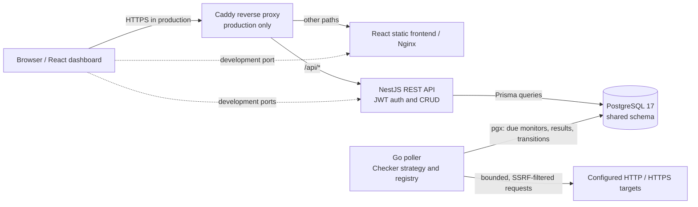

# Sentinel — uptime monitoring and public status

Sentinel is an uptime-monitoring service for HTTP and HTTPS endpoints. Authenticated users manage monitors and inspect check history; a separate Go worker performs checks and records state transitions in PostgreSQL. The React dashboard presents monitoring data, while an optional public status page exposes a deliberately limited view. The monorepo contains a NestJS/TypeScript API, Go worker, React/Vite frontend, and one PostgreSQL 17 schema. It uses no message broker.

- **Live demo:** <https://sentinel.eliottvelarde.com>
- **Public status:** <https://sentinel.eliottvelarde.com/status>
- **Production deployment and operations:** [DEPLOY.md](./DEPLOY.md)

## Try the live demo

Select **Probar demo** (“Try demo”) on the login page to sign in without typing credentials. For manual sign-in, use exactly:

- Email: `demo@example.invalid`
- Password: `demo_password_publica_123`

This is an intentionally shared, limited account: it can have up to 3 monitors, each with a minimum interval of 60 seconds. Its account and example monitors are reset every 60 minutes, so demo changes and history are temporary. Demo access uses a 15-minute token. The service runs on a small VM and availability is best-effort; it is not a production monitoring SLA.

<!-- TODO: add demo video link -->
<!-- TODO: add demo screenshots -->

## Run locally with Docker Compose

Requirements: Docker Engine with the Docker Compose plugin and Git. The development Compose stack starts PostgreSQL, the API, worker, and frontend:

```bash
git clone https://github.com/EliottV17/sentinel-project.git
cd sentinel-project
docker compose up -d --build
```

Open the dashboard at <http://localhost:5173>. The API listens at <http://localhost:8000>, and the development database publishes port `5432`. The worker starts with the stack. Development monitor manifests include public example HTTP targets, and the worker makes real requests to them. Review `demo-monitors.json` and `status-monitors.json` before enabling checks if that network activity is not wanted. The development Compose configuration and defaults are for local use, not production.

## Architecture and data flow



In development, Compose exposes the API, frontend, and database on their local ports. In production, only Caddy publishes host ports `80` and `443`; the API, worker, frontend, and database remain on the private Compose network. Caddy routes `/api/*` directly to the API and other paths to the frontend.

| Component | Responsibility | Implementation |
|---|---|---|
| API | Authentication, user/monitor endpoints, health, public status | NestJS 10, TypeScript 5.7, Prisma 6; Node.js production runtime and Bun package tooling |
| Worker | Poll due monitors, run checks, persist results and transition events | Go 1.25, pgx v5, bounded concurrent work; one registered HTTP checker |
| Frontend | Dashboard, login/demo flow, history and status presentation | React 19, TypeScript 5.9, Vite 7, Tailwind CSS 4, TanStack Query 5, React Router 7; Nginx serves static files |
| Database | Shared users, monitors, checks, and alerts | PostgreSQL 17; API migrations/seeding and worker reads/writes use the same schema |
| Production edge | TLS, security headers, same-origin routing | Caddy 2 |

## Monitoring behavior

### Polling and checker strategy + registry

The Go worker is the only component that performs checks. It polls approximately every two seconds for active monitors that are due, then honors each monitor's configured frequency. A bounded worker pool runs the registered `http` checker. The checker interface and type-name registry implement a Strategy + Registry extension point; HTTP is the only checker currently registered. It supports HTTP and HTTPS on allowed ports (defaults: 80, 443, 8080, and 8443).

The worker is decoupled from the API so polling and network checks continue independently of API request handling and deployments. It reads and writes the shared PostgreSQL schema directly through pgx; the API owns migrations and provides REST access, but does not poll on the worker's behalf. If the worker stops, checks stop.

Every completed check is recorded in `check_result`, and the worker updates the monitor's `last_state` and `last_checked_at`. An `alert` event is recorded only on a state transition: healthy → unhealthy (`down`) or unhealthy → healthy (`recovery`). These are persisted events, not email, SMS, or push notifications.

### Accounts, monitor safety, and public status

- Passwords are hashed with Argon2. Authenticated API routes use JWT bearer tokens; the JWT guard is global and public routes are explicitly marked.
- The checker validates HTTP/HTTPS schemes and allowed ports, resolves and checks all addresses, pins a validated IP for the socket connection, blocks private/local/link-local and other restricted ranges (including metadata and CGNAT ranges), disables proxy use, and revalidates redirects (maximum three). API validation is an early guard; the worker independently enforces target safety. These controls reduce SSRF and DNS-rebinding risk but cannot guarantee every external service is reachable or safe to monitor.
- Default per-IP throttles are 100 requests/minute overall, 5/minute for login and registration, 30/minute for demo login, and 20/minute for monitor mutations. These in-process limits are not distributed coordination. Production uses one trusted Caddy proxy hop, explicit CORS origins, non-default database credentials, and a non-placeholder JWT signing key.
- Ordinary accounts default to at most 10 monitors with a 60-second minimum interval. The shared demo is limited to 3 monitors and the same 60-second minimum, cannot publish monitors, and is reset every 60 minutes. Demo JWTs expire after 15 minutes by default.
- The anonymous status web page is `/status`; its API endpoint is `GET /api/v1/public/status`. It lists only active, published, non-demo monitors and returns exactly `name`, `last_state`, `uptime_percentage`, and `last_checked_at`—not target URLs or owner IDs. Uptime is aggregated in SQL over a 24-hour default window and briefly cached in-process (30 seconds by default).
- The frontend classifies missing or stale data as “No data”, fresh unhealthy state as “Down”, and fresh healthy state according to the uptime threshold (99% by default). These are presentation labels, not a monitoring guarantee.

See the [public status contract](./sentinel-api/src/status/README.md) for response and classification details.

## Production health, retention, backups, and restore

The production Compose stack has healthchecks for PostgreSQL, API, worker, frontend, and Caddy. The API health endpoint checks its database connection; the worker health command checks database connectivity and that the poller heartbeat is fresh, so a stalled or stopped poller is not mistaken for a healthy worker. Production deployment, health inspection, logs, backup, restore, and rollback procedures are documented in [DEPLOY.md](./DEPLOY.md).

The worker applies hourly retention by default: check results older than 30 days and alerts older than 90 days are deleted in bounded batches. The backup utility creates gzip-compressed PostgreSQL dumps and keeps seven by default. Gzip is compression, not encryption; protect backup files and follow the restore runbook in [DEPLOY.md](./DEPLOY.md).

## Repository map

```text
sentinel-api/          NestJS REST API, Prisma schema/migrations, Jest tests
sentinel-worker/       Go checker registry, poll loop, retention, health command
frontend/              React SPA, Vite, Vitest, Nginx configurations
scripts/               PostgreSQL backup utility
test/smoke/             Isolated Compose and backup/restore smoke helpers
docker-compose.yml      Development stack
docker-compose.prod.yml Production stack
Caddyfile               Production reverse-proxy and TLS policy
DEPLOY.md               Production deployment and operations runbook
```

The API owns schema migrations and seed execution. The worker does not create or migrate tables. The frontend and worker do not share a background engine or message broker.

## Development and verification

Use Bun 1.4.x for package scripts, Node.js for Jest/Vitest test runners, and Go 1.25 or later for the worker. Commands are package-scoped; there is no root package manager.

```bash
# API: sentinel-api/
bun install
bun run build
bun run test
# Use a dedicated disposable PostgreSQL database for end-to-end tests.
bun run test:e2e

# Frontend: frontend/
bun install
bun run lint
bun run test
bun run typecheck
bun run build

# Worker: sentinel-worker/
go test -count=1 ./...
go build ./cmd/worker/
```

The API end-to-end suite uses PostgreSQL and seeds/cleans test fixtures; provide a dedicated disposable test database, never development or production data. `NODE_ENV=test` makes Nest ignore dotenv files, so provide test configuration explicitly in the test process. Frontend component tests use Vitest/jsdom and mock API calls. Do not run `scripts/clean.py` or the historical stress seed against a database with user data.

## Author

**Eliott Velarde** · [Portfolio](https://eliottvelarde.com)
