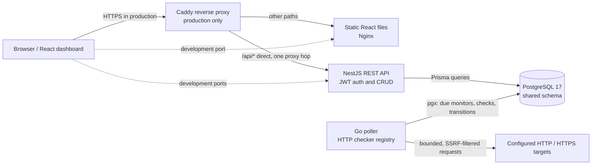

# Sentinel — uptime monitoring and public status

Sentinel lets authenticated users manage HTTP monitors and inspect their check history. A separate Go worker performs the checks and records state transitions in PostgreSQL; a React dashboard presents that data, and an optional public status page exposes a deliberately limited view. The repository is a polyglot monorepo: NestJS/TypeScript API, Go worker, React/Vite frontend, and one PostgreSQL 17 schema. There is no message broker.

- **Live demo:** [pending operator deployment](#deployment-links-pending)
- **Video walkthrough:** [pending owner upload](#deployment-links-pending)
- **Production deployment:** [DEPLOY.md](./DEPLOY.md)

## Try the development stack

Requirements: Docker Engine with the Docker Compose plugin, and Git. For package-level work, install Bun and Go as described below. The development Compose file keeps its existing local ports and defaults; it is not a production configuration.

```bash
git clone https://github.com/EliottV17/sentinel-project.git
cd sentinel-project
docker compose up -d --build
```

Open the dashboard at <http://localhost:5173>. The API listens at <http://localhost:8000>, and the development database publishes port `5432`. The worker starts with the stack. The checked-in development demo defaults are `demo@sentinel.dev` / `DemoPassword123!`; these are public development credentials and must never be reused for private or production accounts. The demo account and its monitors are reset periodically.

Development monitor manifests include public example HTTP targets. Starting the development worker makes real requests to those targets; review `demo-monitors.json` and `status-monitors.json` before enabling checks if that network activity is not wanted.

## Architecture and data flow



The development stack uses the same API, worker, database, and frontend roles but exposes their development ports directly. The production stack is separate: only Caddy publishes host ports `80` and `443`; API, worker, frontend, and database stay on the private Compose network.

| Component | Responsibility | Implementation |
|---|---|---|
| API | Authentication, user/monitor endpoints, health, public status | NestJS 10, TypeScript, Prisma; Node.js in the production container, Bun for package tooling |
| Worker | Poll due monitors, run checks, persist results and transition events | Go 1.25, pgx, bounded concurrent work; one registered HTTP checker today |
| Frontend | Dashboard, login/demo flow, history and status presentation | React 19, TypeScript, Vite, TanStack Query; static files served by Nginx |
| Database | Shared users, monitors, checks and alerts | PostgreSQL 17; API migrations/seeding and worker reads/writes use the same schema |
| Production edge | TLS, security headers, same-origin routing | Caddy routes `/api/*` directly to the API and other paths to Nginx |

## What the system does

### Polling and checker registry

The Go worker is the only component that performs checks. It scans for active monitors that are due approximately every two seconds, then honors each monitor's `frequency`. A bounded worker pool runs the currently registered `http` checker. The interface and type-name registry provide a Strategy/Registry extension point; additional checker types are not claimed to exist yet.

Every completed check is recorded in `check_result`, and the worker updates the monitor's `last_state` and `last_checked_at`. It records an `alert` event only when state changes: healthy → unhealthy (`down`) or unhealthy → healthy (`recovery`). This is an event record, not an email, SMS, or push-notification delivery service. If the worker is stopped, checks stop; the API does not poll on its behalf.

### Accounts, monitor safety, and status

- Passwords are hashed with Argon2 and authenticated API requests use JWT bearer tokens.
- Production requires a non-placeholder `SECRET_KEY`, explicit CORS origins, valid seed identities, and valid monitor manifests. API DTO validation rejects obvious local/private targets; the worker independently enforces HTTP/HTTPS and allowed ports, resolves and checks addresses, pins the selected IP for the connection, and revalidates redirects to reduce SSRF and DNS-rebinding risk.
- Per-IP throttling defaults to 100 requests/minute overall, 5/minute for authentication, and 20/minute for monitor mutations. Per-user defaults are 10 monitors with a 60-second minimum frequency; demo defaults are 3 monitors and the same 60-second minimum.
- The demo account is periodically reconciled from its manifest, has a separate 15-minute token lifetime by default and smaller monitor/frequency limits, and cannot make its monitors public.
- Optional `GET /api/v1/public/status` is anonymous. It includes only active, published, non-demo monitors and returns name, latest state, windowed uptime, and last-check time—never target URLs or owner IDs. Uptime is aggregated in SQL over a configurable window (24 hours by default) and briefly cached in-process (30 seconds by default).
- The frontend classifies missing/stale data as “No data”, fresh unhealthy state as “Down”, and fresh healthy state by the uptime threshold (99% by default). These labels are presentation logic, not a monitoring guarantee.

See the [public status contract](./sentinel-api/src/status/README.md) for response and classification details.

### Security and operating boundaries

The API validates targets as an early guard; the worker is the enforcement point for existing and new records. It blocks private/link-local and other restricted address ranges, pins resolved addresses during dialing, disables proxy-based bypass, checks redirects, and restricts target ports. This reduces SSRF and DNS-rebinding risk but is not a promise that every external service is reachable or safe to monitor. The HTTP checker currently supports only HTTP and HTTPS.

Production has one Caddy proxy hop to the API (`trust proxy=1`), explicit HTTP(S) CORS origins, non-default PostgreSQL credentials, and non-placeholder JWT signing configuration. API throttling and status caching are in-process; they are not distributed coordination mechanisms. The demo login values embedded in the frontend are public by design. Never put private credentials in demo settings or public monitor manifests.

## Repository map

```text
sentinel-api/          NestJS REST API, Prisma schema/migrations, Jest tests
sentinel-worker/       Go checker registry, poll loop, retention, health command
frontend/              React SPA, Vite, Vitest, Nginx configurations
scripts/               PostgreSQL backup utility
test/smoke/             Isolated Compose and backup/restore smoke helpers
docker-compose.yml     Development stack (preserved separately)
docker-compose.prod.yml Production stack
Caddyfile              Production reverse-proxy and TLS policy
```

The API owns schema migrations and seed execution. The worker does not create or migrate tables. No broker, generated runtime, or background engine is shared with the frontend.

## Logs and operations

For the development stack, inspect a bounded tail of the worker's structured JSON output:

```bash
docker logs --tail=100 sentinel_worker
```

The worker logs check state and target information, so treat output as operational data. For production's explicit project/config selection and bounded log commands, follow [DEPLOY.md](./DEPLOY.md); do not dump resolved Compose configuration or container environment values into support logs.

## Development and verification

Use supported local toolchains: Bun `1.4.x` for package scripts, Node.js for the Jest/Vitest test runners, and Go `1.25+` for the worker. Commands are package-scoped; there is no root package manager.

```bash
# API: sentinel-api/
bun install
bun run build
bun run test
# End-to-end tests use a dedicated disposable PostgreSQL database and explicit
# test environment; do not point DATABASE_URL at development or production data.
bun run test:e2e

# Frontend: frontend/
bun install
bun run lint
bun run test
bun run typecheck
bun run build

# Worker: sentinel-worker/
go test -count=1 ./...
go build ./cmd/worker/
```

The API e2e suite reaches PostgreSQL and seeds/cleans test fixtures; supply a dedicated disposable `DATABASE_URL` and any fixture settings expected by the tests. `NODE_ENV=test` makes Nest ignore dotenv files, so provide test configuration explicitly in the test process. The frontend component tests use Vitest/jsdom and mock API calls. Do not run `scripts/clean.py` or the historical stress seed against a database with user data.

### Recorded local evidence

The latest independent functional verification recorded these local results:

- API: 107 unit tests across 16 suites, 51 e2e tests across 7 suites, and build passed in an isolated test environment.
- Worker: all 7 Go packages, full tests, race tests, static build, and a fresh PostgreSQL retention integration passed.
- Frontend: 121 tests across 16 files, lint, typecheck, and build passed using genuine Node.js 22.23.2.
- Compose smoke: 30 helper assertions, 15 production scenarios (142s), and 5 development scenarios (26s) passed, including strict local-CA checks, the sixth-request XFF throttle, worker stall/restart, database-pause recovery, and real retention with public-status uptime preserved at 66.67%.
- Backup: 9 focused regression assertions plus 14 expected-failure cases passed; a fresh PostgreSQL 17 restore matched schema/data snapshots and SQL uptime.

A prior D06 record contains Chromium DOM verification; the latest verifier report does not establish a new browser DOM run. The deployment workflow defines a required AMD64 smoke and a separate optional, non-blocking ARM64 build-only job. Remote CI, an actual ARM64 build, a public VM deployment, a public ACME certificate, live URL, and video remain unverified or owner-maintained.

## Deployment links pending

- Live service URL: add after an operator completes and verifies a public deployment.
- Video walkthrough: add after the owner publishes a recording.
